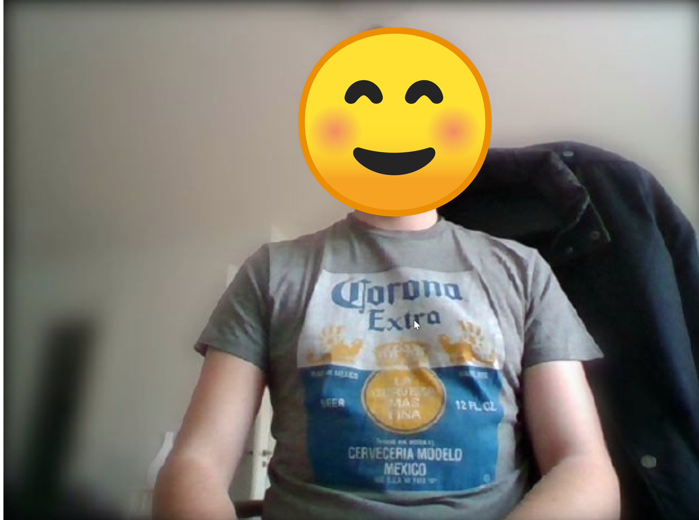
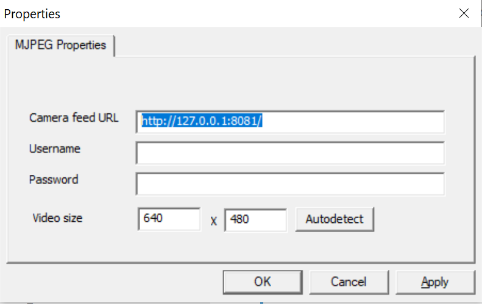

# camiac

_to be done: insert build badge here_

> Background blurring is an effective way to both preserve privacy and keep communication effective during video conferencing.

**camiac** is a simple tool to create a virtual camera (_currently on Windows only_) which implements a background blurring effect using tensorflow.js and body-pix (https://github.com/tensorflow/tfjs-models/tree/master/body-pix).

**Disclaimer**: this is still work in progress and not ready to use!

## Features

- It does not require a green screen, etc - it just works (**Disclaimer:** _at least on my machine_)
- Near realtime processing on a halfway modern laptop without a GPU
- Configurable parameters for bodyPix, stored in the user-profile
- Prediction and camera loop are dispatched to have a smooth camera stream even with less FPS on the segmentation process
- **Narrator-mode** for interactive and bar-raising presentations (okay to be honest it is still **WIP**)

## How it works

- camiac uses the first best camera it finds, captures the video and uses bodyPix for the body segmentation. Then it uses a blur filter to hide the background.
- I was not able to write a DirectShow filter on my on, so camiac just opens a MJPEG Stream on port 8081 and I'm using https://ip-webcam.appspot.com/ to emulate the camera.
- Basically just clone the repository and run `yarn dev`
- Press `CommandOrControl+Y` to toggle the narrator-mode

## Roadmap (**contributors welcome!**)

- Make the narrator mode more useful by using a blurred transition to the background
- Support MacOS (**contributors welcome!**)
- Implement a simple GUI for the settings and which webcam to use
- Implement a TrayIcon
- Handle errors at all and fix some common things: re-enable camera after suspend
- Allow custom backgrounds!
- Packaging, Actions, distribute proper releases
- Create a tampermonkey plugin to emulate a new camera for web-based conferencing
- Allow different camera resolutions
- Track FPS
- Stop processing if app is in background or stream is not used (partially implemented)
- Implement contour tracing and only cutout the contour with the largest area (for narrator-mode)
- Implement a pipeline like approach to allow multiple filters on the same image stream with the final goal to have a simple platform for "webcam fun".

## Limitations

- Not all programs allow DirectShow filters -> doesn't work with UWP
- Probably more

## Screenshots

### Webcam stream example



### Narrator mode example


### IP Cam settings



## Available settings (and defaults)

```json
{
  "configName": "user-preferences",
  "defaults": {
    "httpListenerPort": 8081,
    "mjpegJpegQuality": 0.8,
    "presenter": {
      "width": 640,
      "height": 480,
      "globalShortcut": "CommandOrControl+Y"
    },
    "bodyPix": {
      "architecture": "MobileNetV1",
      "outputStride": 16,
      "multiplier": 0.75,
      "quantBytes": 2,
      "internalResolution": "medium",
      "segmentationThreshold": 0.4,
      "maxDetections": 1,
      "scoreThreshold": 0.8,
      "nmsRadius": 10
    }
  }
}
```
